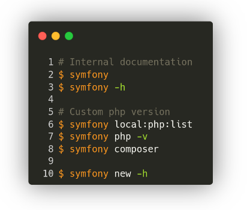
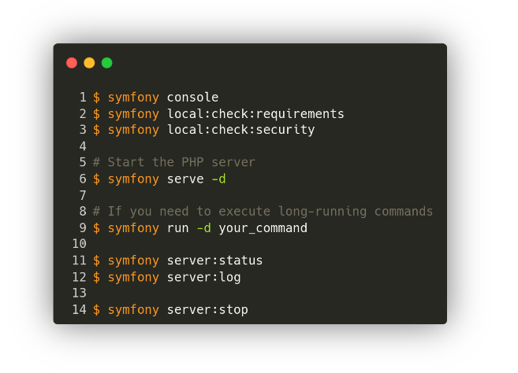

##Symfony CLI

The Symfony CLI is a cross-platform developer tool. It is meant to help you create new Symfony applications and manage them.

It can:
- create new applications
- manage a local development server with TLS
- ease the usage of Composer and Symfony Console
- ease integrations with platform.sh

##Symfony CLI in your project

