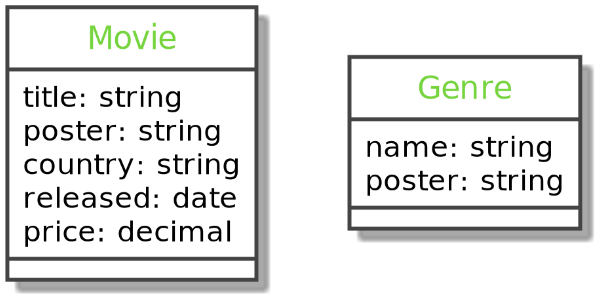

## About

Migrations allow for a safe upgrade/downgrade of table definitions (`up` or `down` methods)
All your operations are stored in versioned files (located in the `migrations/` folder by default)
Migrations are used as a more robust replacement do the command `doctrine:schema:update`

More here: [https://www.doctrine-project.org/projects/doctrine-migrations/en/current/index.html](https://www.doctrine-project.org/projects/doctrine-migrations/en/current/index.html)

## Check your status

- The previously seen command `doctrine:schema:validate` without its `--skip-mapping` flag can be used to check the database connection and if the database schema is in sync with the mapping of your entities.
- You can also use the command `doctrine:mapping:info` to check the mapping information for each entity
- The `doctrine:migrations:status` command will give you information on all the migrations of your system and their status

```bash
# Check connection and db sync
$ symfony console doctrine:schema:validate

# Check your mapped entities
$ symfony console doctrine:mapping:info

# Check connection and db sync
$ symfony console doctrine:migrations:status
```

---

## Generate a new migration

When you make changes to your entities like adding or removing properties or changing their types, create a new migration to apply the changes to your database.

This can be done with the MakerBundle `make:migration` command, which is a shortcut for the `doctrine:migrations:diff` command.

```bash
$ symfony console make:migration

$ symfony console doctrine:migrations:diff

# Check your migration file
# If not satisfied, gently remove that file before running it
```

---

## Apply migration

- To apply the changes in your migration file to the database, run the `doctrine:migrations:migrate` command.
- This command will run every migration that’s not yet been run.
- To run a specific migration, either its up or down method, use the `doctrine:migrations:execute` command with the `--up` or `--down` flag and the migration’s Fully Qualified Class Name

```bash
$ symfony console doctrine:migrations:migrate

# If something's wrong, rollback the last migration with its fully qualified classname
$ symfony console doctrine:migrations:execute {FQCN} --down
```

---

## Exercises

- Create new entities:
  - Movie
  - Genre
- Generate a new migration.
- Store both tables in your database.

