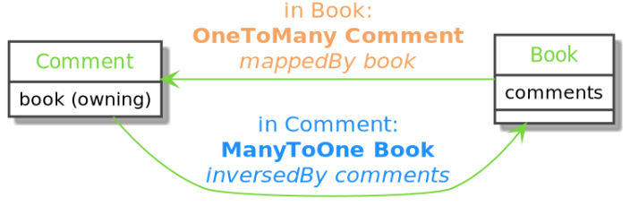
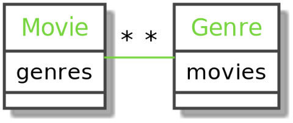

## About

Relationships with Doctrine:
- Are defined at the class level
- Don’t care about foreign keys
- Use class properties as a relationship basis

Types of relationships:
- OneToOne
- ManyToMany
- OneToMany
- ManyToOne

---

## Bidirectional relationship

A bidirectional relationship can be called from either side of the relationship.
One side of the relationship is always defined as the owning side (usually the “Many” side). The actual join column will be on this table.



---

## Create a new relationship

You can add a relationship field (or any type of field) to an existing entity with the MakerBundle `make:entity` command:

```bash
$ symfony console make:entity Book

# Create a field and define a relationship by using the 'relation' wizard as a type
# Don't forget to apply your migration
```

With attributes (recommended):

```php
// src/Entity/Book.php

//...
#[ORM\Entity(repositoryClass: BookRepository::class)]
class Book
{
    //...

    #[ORM\OneToMany(mappedBy: 'book', targetEntity: Comment::class)]
    private Collection $comments;

    public function __construct()
    {
        $this->comments = new ArrayCollection();
    }
    
    //...
}

// src/Entity/Comment.php

#[ORM\Entity(repositoryClass: CommentRepository::class)]
class Comment
{
    //...
    
    #[ORM\ManyToOne(inversedBy: 'comments')]
    private ?Book $book = null;
    
    //...
}
```

With annotations:

```php
// src/Entity/Book.php

//...
/**
 * @ORM\Entity(repositoryClass=BookRepository::class)
 */
class Book
{
    //...

    /**
     * @ORM\OneToMany(mappedBy="book", targetEntity=Comment::class)
     */
    private Collection $comments;

    public function __construct()
    {
        $this->comments = new ArrayCollection();
    }
    
    //...
}

// src/Entity/Comment.php

/**
 * @ORM\Entity(repositoryClass=CommentRepository::class)
 */
class Comment
{
    //...
    
    /**
     * @ORM\ManyToOne(inversedBy="comments")
     */
    private ?Book $book = null;
    
    //...
}
```

---

## Exercises

- Create a relationship between movie and genre entities.
- Generate and run a new migration



---

## Resources

[https://www.doctrine-project.org/projects/doctrine-orm/en/current/index.html](https://www.doctrine-project.org/projects/doctrine-orm/en/current/index.html)