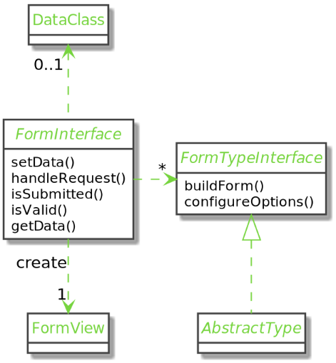

## About Forms

Every form needs to be built, displayed, and processed when filled.

The Forms Component abstracts the logic behind each step

- The component’s API helps you create FormTypes which are fields, fields collections, or entire forms
- Form rendering is made easier thanks to the FormView API and Twig functions
- Form processing with the Request’s data is done in one method call and an eventual object of the associated data class is filled

