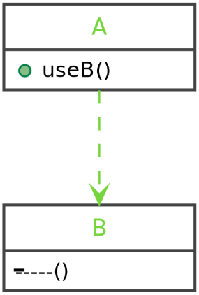

## What are we talking about?

- Think about a mailer object…
- Do you configure it by yourself?
- What about a custom mailer?
- And its dependencies?
- How to provide it to a controller?

---

## Inversion of Control

>In software engineering, inversion of control (IoC) is a programming principle. IoC inverts the flow of control as compared to traditional control flow. In IoC, custom-written portions of a computer program receive the flow of control from a generic framework. A software architecture with this design inverts control as compared to traditional procedural programming: in traditional programming, the custom code that expresses the purpose of the program calls into reusable libraries to take care of generic tasks, but with inversion of control, it is the framework that calls into the custom, or task-specific, code.

[https://en.wikipedia.org/wiki/Inversion_of_control](https://en.wikipedia.org/wiki/Inversion_of_control)

- Symfony, as most frameworks, is based on one simple concept: Inversion of Control.
- It means that instead of having your custom application call for specific parts of a framework, the frameworks itself calls and controls the flow of your application.
- Practically speaking, Symfony handles and abstracts most of the heavy lifting of running your specific code in the proper context, injecting every time the required dependencies.

---

## Dependency

<table>
    <tr>
        <td>
            <ul>
                <li>Class A depends on class B</li>
                <li>Before using A, we must ensure this dependency is met</li>
                <li>We also need to make sure that B also has its dependencies met</li>
                <li>We need to make sure of this for every bit of code needing an instance of class A</li>
            </ul>
        </td>
        <td>
            
        </td>
    </tr>
</table>