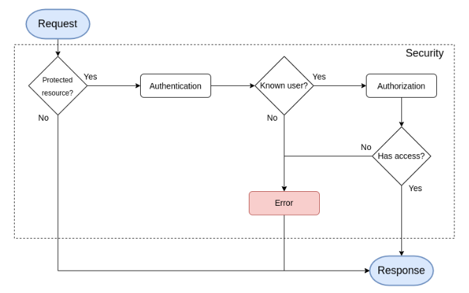

## Workflow

## Keywords

**Security:**

- Revolves around the User
- Has 2 layers:
  - **Authentication**: Is the user known from the app?
  - **Authorization**: Is the current user allowed to access this particular resource?

**Authentication (Firewall):**
- User provider: Retrieve users from any source (DB, in_memory, API…)
- Authenticators: Checks the Security Passport to authenticate the User 

**Authorization (Access Control):**
- AccessDecisionManager: Grants or denies access based on the voters’ answers
- Voters: Services that answer (yes, no, no idea) to a given question

