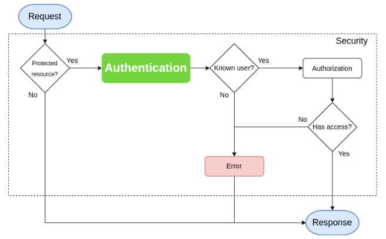
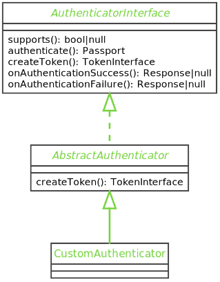

## Authentication



**Authenticators:**
- Responsible for comparing the request user’s credentials against the user fetched by the UserProvider
- Several built-in authenticators:
  - Form login
  - LDAP
  - Json login
  - HTTP Basic
  - ...
- Custom authenticators can be created too for specific needs by implementing `AuthenticatorInterface`

## Authenticators



---

## Custom authenticator

```bash
$ symfony console make:auth
```

## Configuration

```yaml
# config/packages/security.yaml

security:
  enable_authenticator_manager: true

  #...
  firewalls:
    main:
      custom_authenticators:
        - App\Security\MyCustomAuthenticator
```

---

## Update your custom authenticator

Open and edit your fresh authenticator.


- The “authenticate” method must return a Passport
- A Passport contains at least a UserBadge and the request’s credentials
- The UserBadge ships the user’s identifier and a provider 

## Passports and Badges

The passport is an object that contains the user to be authenticated as a UserBadge.
It also contains credentials if they are needed.

Furthermore, it contains information as Badges:
- If “Remember me” should be enabled
- If the password needs an upgrade
- ...

## Update your custom authenticator

```php
public function authenticate(Request $request): Passport
{
    //...
    return new Passport(
        new UserBadge($request->request->get('email')),
        new PasswordCredentials($request->request->get('password'))
    );
}
```

