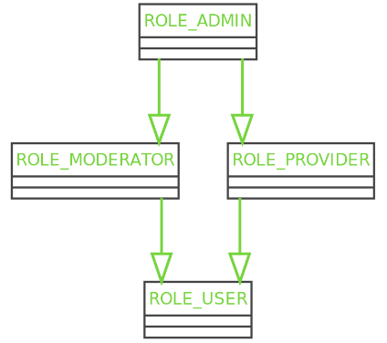

## Authorization


## How to check authorization?

**For each matching request:**
- access_control in your `security.yaml` file allows you to deny access base on URL patterns
**In a controller:**
- `$this->isGranted()`, or `$this->denyAccessUnlessGranted()` in a class extending AbstractController
- `@IsGranted()` annotation (only with the SensioFrameworkExtraBundle)
**In a service:**
`AuthorizationCheckerInterface::isGranted()`, or `Security::isGranted()`
**In a template:**
- `is_granted()` Twig function

## Attributes to check

The default behavior checks roles
- Role names are totally free, but are prefixed by `ROLE_`
Or you can check operations on a given subject
- For example: `{ publish ; $book }`
- See _“Custom Voters”_

## How to check

With voters
- Voters are classes tasked with answering a specific question (“is the current user the owner of this resource?”, yes, no, abstain)
Built-in voters:
- RoleVoter
- RoleHierarchyVoter
Custom voters

---

## Roles - Hierarchy

```yaml
# config/packages/security.yaml

security:
  role_hierarchy:
    ROLE_USER: ~
    ROLE_MODERATOR: ROLE_USER
    ROLE_PROVIDER: ROLE_USER
    ROLE_ADMIN:
      - ROLE_MODERATOR
      - ROLE_PROVIDER     
```



## Roles Storage

- Roles are retrieved using `UserInterface::getRoles(): array`
- Base implementation will ensure users always have at least `ROLE_USER`
- You should however not call `UserInterface::getRoles()` directly, as it won’t have knowledge of any role hierarchy
- Roles can also be stored in database, or any other means

## Access control

```yaml
# config/packages/security.yaml

security:
  access_control:
    - { path: ^/admin, roles: ROLE_ADMIN }
    - { path: ^/profile, roles: ROLE_USER }
```

Access control allows you to manage access to a URI or a group of matching URIs based on one or more constraints:
- Role(s)
- Host
- HTTP method
- ...

[See more](https://symfony.com/doc/current/security/access_control.html)

---

## Controller and authorization

With attributes:

```php
use Sensio\Bundle\FrameworkExtraBundle\Configuration\IsGranted;
//...

class DefaultController extends AbstractController
{
    #[Route('/', name: 'app_home')]
    #[IsGranted('ROLE_ADMIN')]
    public function index(MovieRepository $repository): Response
    {
        dump($this->isGranted('ROLE_ADMIN'));
        $this->denyAccessUnlessGranted('ROLE_ADMIN');
        
        //...
    }
}
```

IsGranted attribute:

```php
use Sensio\Bundle\FrameworkExtraBundle\Configuration\IsGranted;
//...

class BookController extends AbstractController
{
    #[Route('/book/{book}', name: 'book_update', methods: ['GET', 'POST'])]
    #[IsGranted('ROLE_USER')]
    public function update(Request $request, Book $book): Response
    {
        //...
    }
}
```

@IsGranted annotation:

```php
use Sensio\Bundle\FrameworkExtraBundle\Configuration\IsGranted;
use Symfony\Component\Routing\Annotation\Route;
//...

class BookController extends AbstractController
{
    /**
    * @Route("/book/{book}", name: "book_update", methods: {"GET", "POST"})
    * @IsGranted("ROLE_USER")
    */
    public function update(Request $request, Book $book): Response
    {
        //...
    }
}
```

isGranted shortcut:

```php
use Sensio\Bundle\FrameworkExtraBundle\Configuration\IsGranted;
//...

class BookController extends AbstractController
{
    #[Route('/book/{book}', name: 'book_update', methods: ['GET', 'POST'])]
    public function update(Request $request, Book $book): Response
    {
        if ($this->isGranted('ROLE_ADMIN')) {
            // Special action for admins
        }
        //...
    }
}
```

denyAccessUnlessGranted shortcut:

```php
//...

class DefaultController extends AbstractController
{
    #[Route('/', name: 'app_home')]
    public function index(MovieRepository $repository): Response
    {
        $this->denyAccessUnlessGranted('ROLE_ADMIN');
        
        //...
    }
}
```

---

## Service and authorization

```php
class BookService
{
    private AuthorizationCheckerInterface $checker;
    
    public function __construct(AuthorizationCheckerInterface $checker)
    {
        $this->checker = $checker;
    }
    
    public function doSomethingAdmin(): void
    {
        if (!$this->checker->isGranted('ROLE_ADMIN')) {
            //...
        }
        //...
    }
}
```

---

## Template and authorization

```php

    <div>Welcome, {{ app.user.firstname }}</div>

```