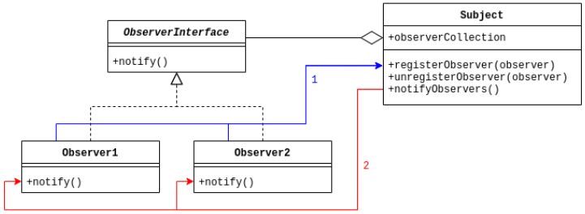
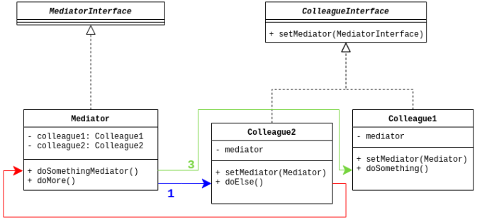
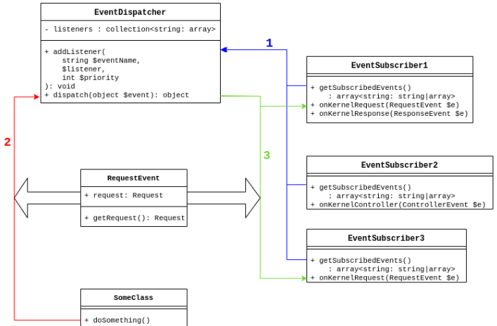

## What are we talking about?

The EventDispatcher Component allows parts of your application to communicate with each other without depending on each other, to help you decouple your code.

It implements the Mediator and Observer design patterns, meaning that a central object, the EventDispatcher, gets notified of specific actions by your application, and in turn notifies listeners of this specific action.

## Observer pattern

>The observer pattern is a software design pattern in which an object, named the subject, maintains a list of its dependents, called observers, and notifies them automatically of any state changes, usually by calling one of their methods.
>
>It is mainly used for implementing distributed event handling systems, in "event driven" software.



---

## Mediator pattern

>In software engineering, the mediator pattern defines an object that encapsulates how a set of objects interact. [...]
>
>With the mediator pattern, communication between objects is encapsulated within a mediator object. Objects no longer communicate directly with each other, but instead communicate through the mediator. This reduces the dependencies between communicating objects, thereby reducing coupling.



---

## In Symfony

- An Event is an object with a specific identifier containing data related to its purpose
- A listener is a function that will wait for a specific event to exploit the data associated with it and perform specific actions.
- Listeners will tell the Event Dispatcher which event they are listening
- The EventDispatcher can register any number of listeners for one given Event
- When you (or Symfony) call for the EventDispatcher to dispatch an Event, all its listeners are notified

## Overview



---

## Listeners

- There are many built-in events dispatched during Symfony’s flow
- Each listener may be given a priority. This will define the order in which all the listeners for one given event will be called
- You can check which events and listeners are registered by the Dispatcher with the following command 

```bash
$ symfony console debug:event-dispatcher

Register Listeners Grouped by Event
===================================

"Symfony\Component\Mailer\Event\MessageEvent" event
---------------------------------------------------

 ------- --------------------------------------------------------------------------- ----------
  Order   Callable                                                                    Priority
 ------- --------------------------------------------------------------------------- ----------
  '#1'    Symfony\Component\Mailer\EventListener\MessageListener::onMessage()         0
  '#2'    Symfony\Component\Mailer\EventListener\EnvelopeListener::onMessage()        -255
  '#3'    Symfony\Component\Mailer\EventListener\MessageLoggerListener::onMessage()   -255
 ------- --------------------------------------------------------------------------- ----------
 
"Symfony\Component\Messenger\Event\WorkerMessageFailedEvent" event
------------------------------------------------------------------
```