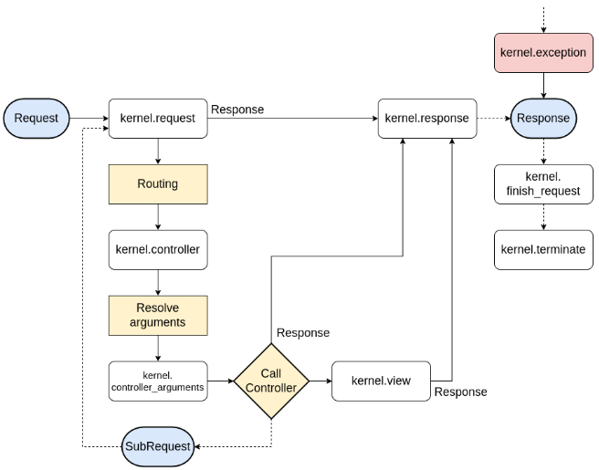

## Events

- Each Event dispatched by the EventDispatcher is an object extending the Event class, with a specific name and containing all the data necessary to the listeners.
- Symfony and many other libraries dispatch their own events.
- If you need, you can also create and dispatch your own custom events by extending the Event class.

## Main Symfony events explained

### **Kernel events:**
- **REQUEST**: Dispatched when an HTTP request is received, allows to return an early response.
- **CONTROLLER**: Dispatched when the controller for the request has been resolved.
- **CONTROLLER_ARGUMENTS**: Dispatched when the arguments of the controller for the request have been resolved.
- **VIEW**: Dispatched after the controller returned anything but a Response
- **RESPONSE**: Dispatched just before returning a Response.
- **FINISH_REQUEST**: Dispatched after the Response has been sent to close last tasks
- **TERMINATE**: Dispatched after the Response has been sent to close last tasks

---

## Main Symfony events explained



### **Security events:**
- **INTERACTIVE_LOGIN**: Triggered when the user manually authenticates.
- **AUTHENTICATION_SUCCESS**
- **AUTHENTICATION_FAILURE**
- **SWITCH_USER**: Triggered when a user switches to someone else’s account.

[See more](https://symfony.com/doc/current/components/http_kernel.html)

---

## Custom events

- Start by writing a new event class according to your needs. This class should extend the `Symfony\Contracts\EventDispatcher\Event` class.
- Then autowire the EventDispatcher where you want to dispatch the event, and use the dispatcher’s `dispatch()` method by giving it your event and the event’s name.
- Your event can now be listened and subscribed to like any other event.

```php
<?php

// src/Events/BookEvent.php

namespace App\Events;

use App\Entity\Book;
use Symfony\Contracts\EventDispatcher\Event;

class BookEvent extends Event
{
    public const NAME = 'book.order';
    private Book $book;
    
    public function __construct(Book $book)
    {
        $this->book = $book;
    }
    
    public function getBook(): Book
    {
        return $this->book;
    }
}
```

```php
<?php

namespace App\Controller;

//...
use App\Events\BookEvent;
use Psr\EventDispatcher\EventDispatcherInterface;

#[Route('/book/admin')]
class BookAdminController extends AbstractController
{
    //... 
    
    #[Route('/add', name: 'app_book_admin_add', methods: ['GET', 'POST'])]
    public function add(
        Request $request,
        BookRepository $bookRepository,
        EventDispatcherInterface $dispatcher
    ): Response
    {
        $book = new Book();
        $form->$this->createForm(BookType::class, $book);
        $form->handleRequest($request);
        
        if ($form->isSubmitted() && $form->isValid()) {
            $bookRepository->save($book);
            // Dispatch event if book has been persisted
            $dispatcher->dispatch(new BookEvent($book), BookEvent::NAME);
            //...
        }
        //...
    }
}
```

```php
<?php

namespace App\EventSubscriber;

use App\Events\BookEvent;
use Symfony\Component\EventDispatcher\EventSubscriberInterface;

class BookSubscriber implements EventSubscriberInterface
{
    public function onBookOrder($event)
    {
        //...
    }
    
    public static function getSubscribedEvents()
    {
        return [
            BookEvent::NAME => 'onBookOrder'
        ];
    }
}
```

---

## Exercises

- Store into your database the last connection time of your users.
  _Try to store the last time a user `actually` logs in._
- Add a method to retrieve all admin users from the database. All admin roles will contain the ADMIN word.
- Create a new MovieEvent
- Dispatch the event if an underage user tries to view details about a restricted movie
- Subscribe to the new event and display a dump when the listener is called

---

## Resources

- [https://symfony.com/doc/current/components/event_dispatcher.html](https://symfony.com/doc/current/components/event_dispatcher.html)
- [https://symfony.com/doc/current/components/http_kernel.html](https://symfony.com/doc/current/components/http_kernel.html)
